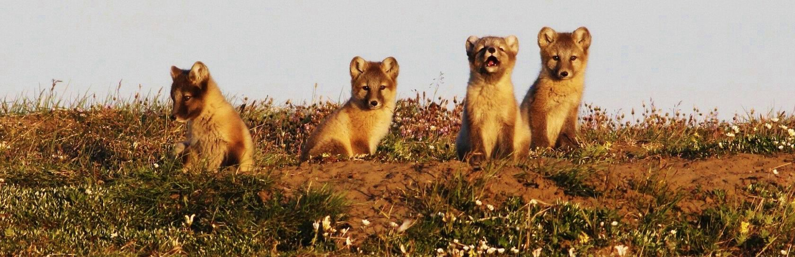

# foxes

This is an article about foxes with interactive elements.

## text input

<FillIn>
  Foxes belong to the genus <Blank answer="Vulpes" />, which includes several species such as the red fox, fennec fox, and Arctic fox. These animals are known for their intelligence and flexible behavior, allowing them to survive in many different habitats across the world.

  Foxes are considered <Blank answer="omnivores;omnivore" />, which means their diet includes both animal and plant material. In addition to hunting small animals, they may also eat berries, fruits, and other vegetation when available, especially during seasons when prey is scarce.
</FillIn>

## interactive drag and drop

<DragAndDrop words="nocturnal;communication;dens;Arctic;balance;adaptable;hearing;territory;camouflage;urban environments">
  

  Most foxes are primarily <DropZone answer="nocturnal" />, meaning they are active during the night. This behavior helps them avoid larger predators and human activity while increasing their chances of catching prey such as rodents, insects, and small birds.

  Their excellent sense of <DropZone answer="hearing" /> allows them to detect small movements beneath snow, grass, or soil. A fox can listen carefully and then perform a precise pounce, diving headfirst to capture hidden prey. Many fox species dig underground <DropZone answer="dens" /> where they rest, store food, and raise their young. These spaces may contain multiple entrances and tunnels, providing protection from predators and harsh weather.

  The <DropZone answer="Arctic" /> fox is particularly well adapted to extremely cold climates. Its thick fur changes color with the seasons, helping it survive freezing temperatures and blend into snowy landscapes.

  Foxes rely on several forms of <DropZone answer="communication" /> including vocal sounds, body language, and scent marking. Different calls can signal warnings, attract mates, or help family members locate each other. Through scent marking, foxes establish and defend their <DropZone answer="territory" />. These boundaries help reduce conflicts with neighboring foxes and ensure access to food resources.

  Their fur often provides natural <DropZone answer="camouflage" />, helping them blend into forests, grasslands, or snowy environments. This ability makes it easier to approach prey without being noticed.

  Foxes play an important role in ecological <DropZone answer="balance" /> because they control populations of rodents and other small animals that might otherwise grow too numerous.

  Many species are highly <DropZone answer="adaptable" />, which is why foxes are increasingly found living near humans. They have successfully learned to survive in farms, suburbs, and even large cities. In fact, some fox populations now live in <DropZone answer="urban environments" />, where they search for food scraps, small animals, or insects while navigating streets, gardens, and parks.
</DragAndDrop>

You can check if the answers are correct by using the "check answers" button above.

## rest of the article

As you can see there is more content after the interactive element.

## questions

<ChoiceSet>
  1. What do foxes primarily eat?
  <Choices single>
    <Choice explanation="Foxes do not graze like herbivores. While they occasionally eat plant matter such as fruits and berries, grass and leaves make up a negligible part of their diet.">Grass and leaves</Choice>
    <Choice correct explanation="Foxes are omnivores that eat a varied diet including rabbits, mice, birds, fruits, and berries. They are opportunistic hunters and foragers, adjusting what they eat based on season and availability. In autumn, for example, fruit and berries can make up a significant portion of their diet.">Small mammals, birds, and berries</Choice>
    <Choice explanation="Foxes are not aquatic feeders. While they may occasionally catch fish in shallow water, fish and aquatic plants are not a meaningful part of their typical diet.">Fish and aquatic plants</Choice>
    <Choice explanation="While foxes do eat insects as an occasional snack, insects alone do not constitute their primary diet. Foxes rely on a much broader range of food sources, especially small mammals.">Insects only</Choice>
  </Choices>
  
  2. What is a female fox called?
  <Choices single>
    <Choice>doe</Choice>
    <Choice correct>vixen</Choice>
    <Choice>vamp</Choice>
    <Choice>queen</Choice>
  </Choices>
</ChoiceSet>

  3. Categorize habitats.
  <Categorize words="forest;desert;arctic tundra;coral reef;grassland;deep ocean;mountains;open sea;Antarctica">
    <Category label="Foxes can live here" answer="forest;desert;arctic tundra;grassland;mountains" />
    <Category label="Foxes cannot live here" answer="coral reef;deep ocean;open sea;Antarctica" />
  </Categorize>