# Low-tech Remedies

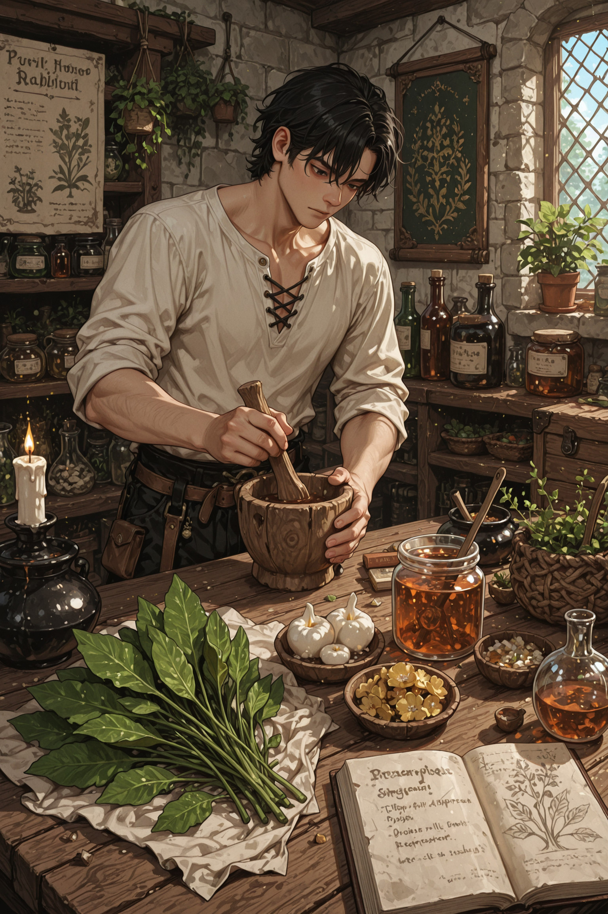

A reference to natural and low-technology materials with genuine medicinal value, focused on combating infection, controlling bleeding, relieving pain, and dressing wounds.

**Caution 1.** While these remedies do genuinely work, herbalism is inherently imprecise, doses are uncertain, plant potency varies wildly with species and season, and modern medicine has either integrated or superseded all of it. This guide is far more useful for adding flavor to storytelling and roleplay than as actual medical advice.

**Caution 2.** The single most important wound-care step is not a herb. It is irrigation – flushing a wound with plenty of clean water (boiled, then cooled) to remove dirt, debris, and bacteria. No poultice or salve can fix a wound that is still full of contamination. A clean wound left alone will fare better than a dirty wound packed with the finest herbs.

## Antimicrobials and Wound Dressing

### Strong Alcohol

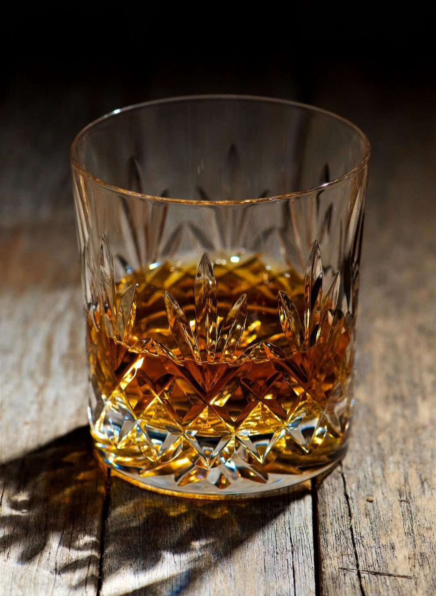

Excellent for disinfecting skin and tools before a procedure. Alcohol kills microbes by denaturing their proteins and dissolving their cell membranes.

Counter-intuitively, it is not the strongest spirit that works best. The effective range is roughly 60–90% alcohol, with about 70% considered ideal. Pure or near-pure alcohol evaporates too fast and coagulates the outer layer of a microbe's proteins so quickly that it seals the interior off before it can be killed. The water in a 70% mix slows evaporation and helps the alcohol penetrate. In practice this means ordinary distilled spirits at around 40% are weak disinfectants – usable in a pinch, but a strong spirit is far better.

Do not pour alcohol directly into an open wound. It damages exposed living tissue and slows healing. Use it on intact skin around the wound and on tools. For the wound cavity itself, clean water is a better choice.

### Honey

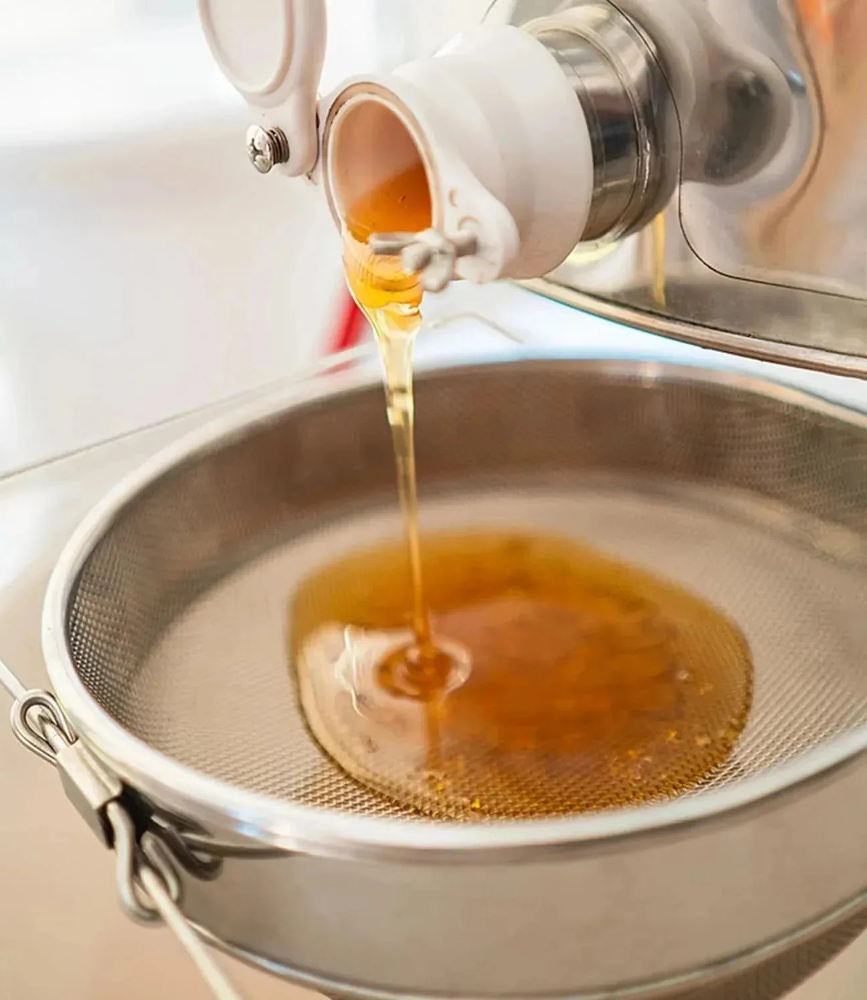

Raw, unprocessed honey is genuinely antimicrobial, and works through several mechanisms at once. It is strongly acidic (low pH), which most bacteria can't survive. It is extremely concentrated sugar (high osmolarity), so it draws water out of bacterial cells by osmosis and leaves them unable to function. Plus it slowly releases small amounts of hydrogen peroxide, which is a mild disinfectant.

The hydrogen peroxide is not sitting in the honey ready-made. Glucose oxidase produces it gradually only once the honey is diluted by wound fluid, so the antiseptic effect switches on where it is needed and continues over time rather than all at once.

Not all honey is equal. Manuka-type honeys contain a second antimicrobial agent, methylglyoxal, that does not depend on peroxide and keeps working even where the peroxide is neutralized.

**Usage:** apply a thin layer directly to a cleaned wound. It suppresses bacterial growth, keeps the wound moist (which aids healing), and tends to reduce scarring.

Two cautions. Raw honey can carry botulism spores; these are harmless on an adult's wound but must never be eaten by an infant under one year old. (Medical-grade honey is irradiated to kill these.) Heat destroys the active enzymes, do not boil honey if you want it to work as an antiseptic.

### Garlic

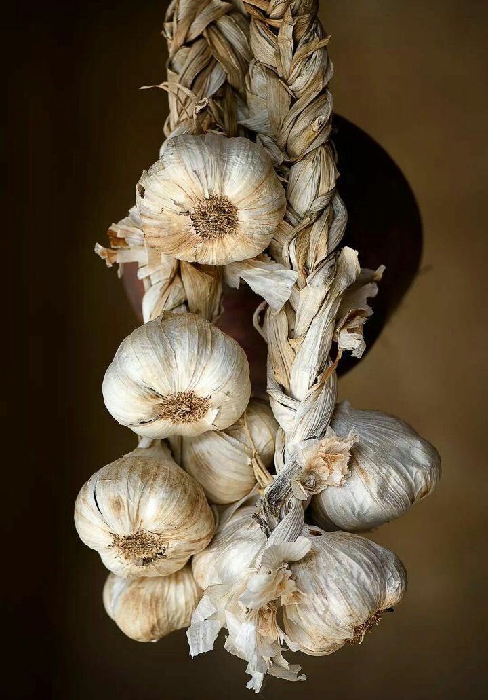

Raw garlic produces allicin, a compound with real antimicrobial properties. The detail that matters: allicin does not exist in the intact clove. It only forms when the clove is crushed, which mixes a stored precursor with an enzyme, and the reaction needs about ten minutes to complete. Heat destroys both the enzyme and the allicin, so garlic must be crushed, rested, and used raw to have any effect.

**Usage:** crush and apply to infected skin surfaces, or have the patient eat it. Do not pack it into deep wounds. Raw crushed garlic held against skin causes chemical burns – use it only as a brief poultice, ideally with a cloth barrier between garlic and skin, and never leave it wrapped in place for hours.

### Pine Resin

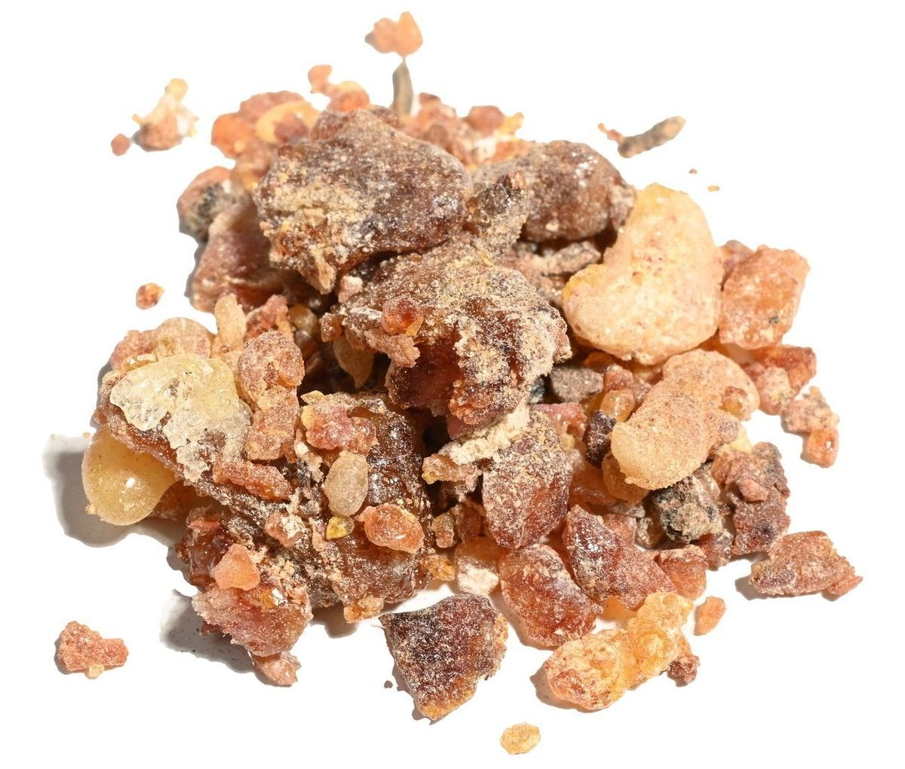

The sticky sap of pine and related conifers is antimicrobial and was traditionally used to seal and protect wounds. Its resin acids inhibit many bacteria and fungi by breaking down their cell walls, and physically the salve forms a sticky, water-resistant film that helps keep new contaminants out.

**Usage:** Warmed gently and worked into fat or beeswax (raw pitch alone is too brittle and sticky to spread), it makes a protective salve for shallow cuts, scrapes, cracked skin, and chapping. Clean the wound thoroughly first — the same seal that keeps contamination out will trap it in, so it's best on minor wounds you can actually get clean, and not packed into a deep or filthy puncture.

### Sphagnum Moss

Used as a wound dressing as recently as the First World War, when cotton ran short and surgeons turned to bog moss by the ton. It is extraordinarily absorbent – it can hold many times its own weight in fluid, far more than cotton – and it is naturally acidic and mildly antiseptic, which slows the growth of bacteria in the soaked dressing.

**Usage:** use the cleanest available moss (boil and dry it if you can), and pack it over a base dressing (direct contact with the wound carries a risk of fungal infection) to soak up discharge from a wound. It is a dressing material, not a cure.

## Controlling Bleeding

### Yarrow "Soldier's Woundwort"

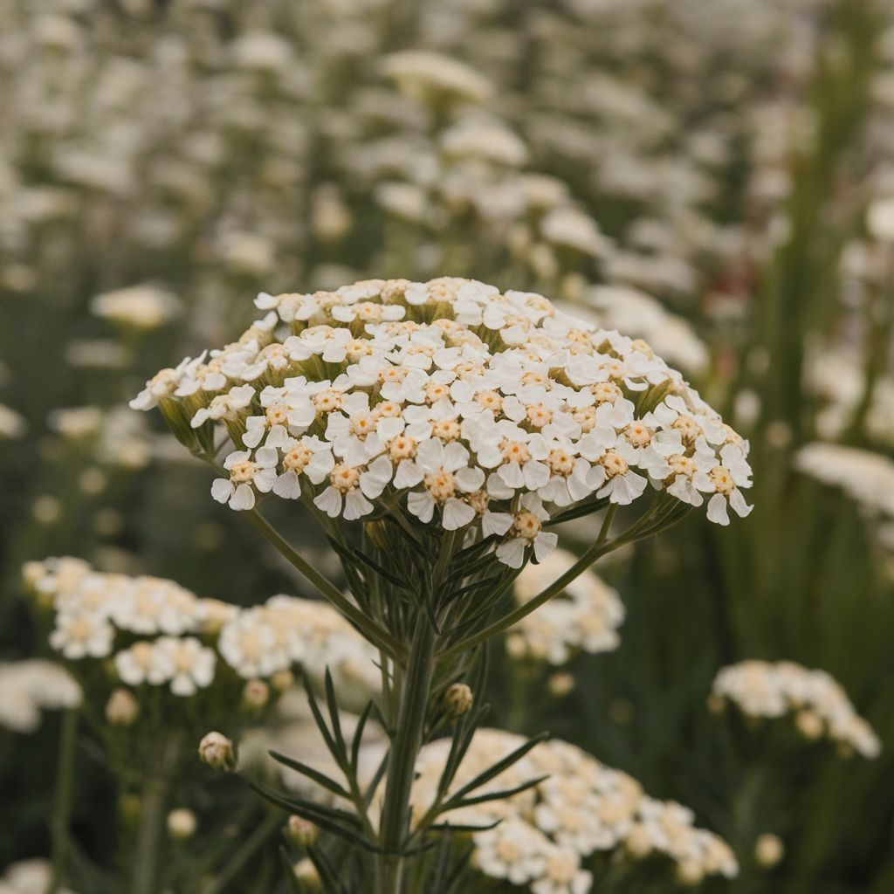

The classic battlefield herb, used to staunch bleeding for so long that its botanical name, *Achillea millefolium*, credits the Greek hero Achilles with treating his soldiers' wounds with it. It works through two mechanisms. An alkaloid called achilleine promotes the blood's natural clotting process, and the plant is rich in tannins that constrict small blood vessels and tighten the surface tissue, slowing the ooze. On top of that it is mildly antiseptic and pain-relieving.

**Usage:** crush or chew fresh leaves into a poultice and press it onto a cut or graze, holding firm pressure. Dried and ground to a powder, it works as a styptic dust sprinkled straight onto a bleeding wound, where it fuses into the scab. It is a remedy for minor surface bleeding only – no herb substitutes for firm pressure on a serious wound, and deep or arterial bleeding is beyond anything a poultice can manage.

## Inflammation, Sprains, and Tissue Repair

### Broadleaf Plantain

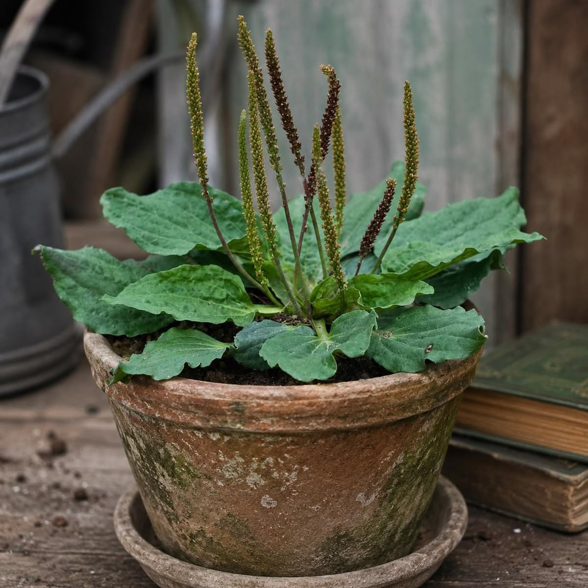

The flat-leafed weed common along trails and trodden paths. It contains anti-inflammatory and tissue-healing compounds, notably allantoin (which encourages new cell growth) and aucubin (which is mildly antimicrobial), along with astringent tannins.

**Usage:** crushed or chewed into a poultice, it soothes irritated skin and is the traditional "drawing" remedy: pressed over irritated skin or a minor infection, it eases the swelling by reducing histamine release and has a modest antimicrobial properties. It is gentle enough to use freely on the skin.

### Comfrey "Knitbone"

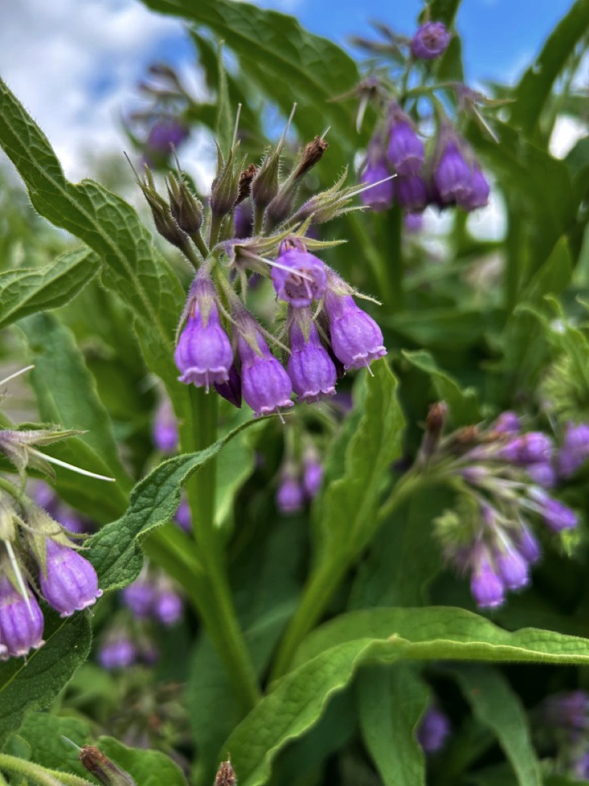

The traditional poultice for sprains and bruises – the folk name "knitbone" records the belief that it speeds the knitting of fractures. It is very rich in allantoin, which promotes the proliferation of new tissue, and it genuinely seems to help closed injuries heal faster.

**Caution:** comfrey contains pyrrolizidine alkaloids, which are toxic to the liver. It must be used strictly topically and never ingested – not as a tea, not eaten. Because those alkaloids can be absorbed through damaged skin, apply it only to closed injuries such as sprains and bruises, and keep it off broken skin and open wounds.

**Usage:** apply as a poultice or salve over a closed injury.

### Aloe

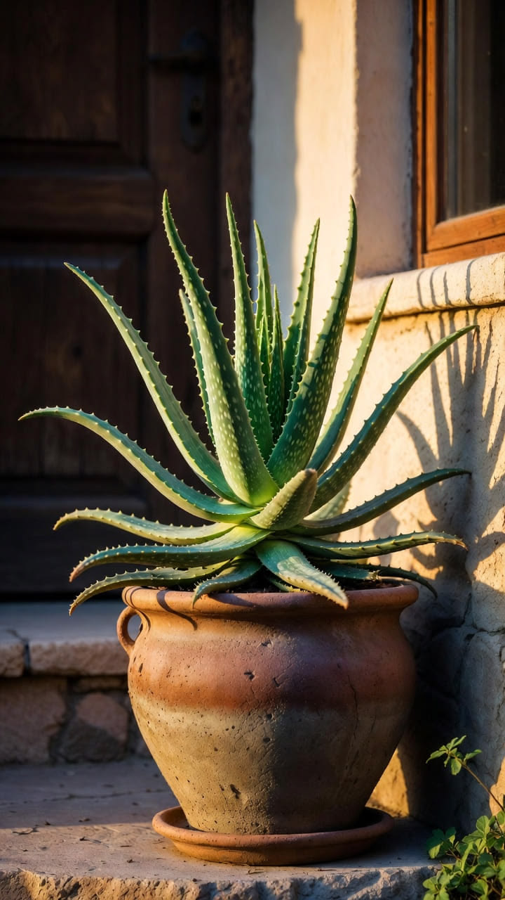

The clear gel from inside the leaf is soothing and anti-inflammatory, calming irritated skin and easing the sting of a burn. Heat destroys its active compounds, so it must be used fresh from the leaf, not cooked into anything.

**Usage:** best for superficial burns, sunburn, and minor scrapes. It is not suitable for deep wounds – on a deep or surgical wound it can actually slow healing.

## Pain Relief and Fever

### Willow Bark

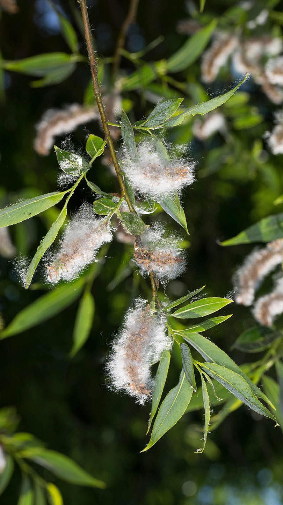

The salicin in the bark is metabolized into salicylic acid in the body, which has anti-inflammatory, analgesic (pain-relieving), and fever-reducing effects. This is the natural precursor of aspirin – aspirin was developed as a gentler-on-the-stomach modification of the same salicylic acid. White willow bark is the most studied and the one most often found in commercial herbal supplements. Meadowsweet is an alternative source.

Use fresh bark directly for a brew, or dry it slowly in a shaded, well-ventilated spot. Properly dried bark can be stored for up to 1–2 years in an airtight container away from light and moisture. The inner (cambium) side should face outward when drying to prevent mold. Young branches and shoots are best — their bark is thin, flexible, and rich in active compounds.

**Usage:** boil bark in water for 20 minutes, strain, and use as a drink for pain, fever, and inflammation. Dose: a full cup of strong willow bark tea every 4–6 hours.

**Caution:** should not be given to children or teenagers with a fever or viral illness, due to the risk of a rare but life-threatening liver and brain condition (Reye's syndrome), same as aspirin.

### Cloves

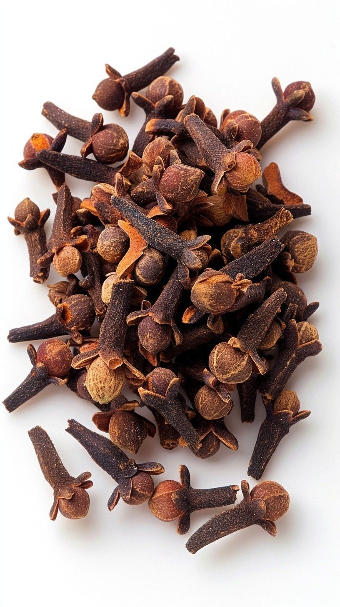

Useful for dental pain such as an abscessed or aching tooth. Cloves contain eugenol, a genuine local anesthetic and antiseptic still used in dentistry today. Eugenol numbs the nerve and kills bacteria at the site, which is exactly what an aching, infected tooth needs as a stopgap.

**Usage:** bite down on a whole clove near the painful tooth, or dab a small amount of clove oil on it for real numbing relief. Clove oil is potent – use small amounts, keep it to the affected area, and avoid swallowing large quantities, as they can be toxic.

---

## Exercises

Match each remedy to what it is mainly for.

<Categorize words="willow bark;yarrow;cloves;honey;comfrey;sphagnum moss;aloe;strong alcohol">
  <Category label="Pain relief" answer="willow bark;cloves" />
  <Category label="Fighting infection / disinfecting" answer="honey;strong alcohol" />
  <Category label="Stopping bleeding" answer="yarrow" />
  <Category label="Soothing skin irritation" answer="comfrey;aloe" />
  <Category label="Absorbing wound discharge" answer="sphagnum moss" />
</Categorize>

Getting the details right.

<ChoiceSet>

You need to disinfect a knife before using it to cut the skin to pull out a small object stuck below it. Which choices are a sure way to do it right?
<Choices>
  <Choice explanation="Pure spirit evaporates too fast and seals microbes' outer proteins before killing them, making it a poorer disinfectant than a diluted one.">Wipe with the most concentrated, near-pure spirit you have.</Choice>
  <Choice correct explanation="Around 70% alcohol is ideal – strong enough to denature proteins, with enough water to slow evaporation and penetrate the microbe.">Wipe with a strong spirit at about 70% alcohol.</Choice>
  <Choice explanation="Ordinary spirits are weak disinfectants – 40% is usable in a pinch, non-distilled spirits might do more harm than good.">Wipe with table wine or ale.</Choice>
  <Choice explanation="honey is anti-microbial but too slow acting to do anything to sterilize a blade">Wipe with honey</Choice>
  <Choice correct explanation="Almost no microbes can sustain themselves in high temperature for long.">Boil the blade in water for a few minutes.</Choice>
</Choices>

Why must garlic be crushed uncooked and left to sit for about ten minutes, to work as an antimicrobial?
<Choices single>
  <Choice correct explanation="Allicin isn't present in the intact clove; crushing triggers an enzyme reaction that takes a few minutes to form it, and heat destroys both the enzyme and the allicin.">The active compound, allicin, only forms after crushing and is destroyed by heat.</Choice>
  <Choice explanation="The delay is about the chemistry of allicin formation, not about water.">Resting it draws moisture out so it concentrates more.</Choice>
  <Choice explanation="Raw garlic is actually more likely to cause chemical burns if used for too long, but boiling it prevents it from working in the first place">Because raw garlic is less likely to cause chemical burns.</Choice>
</Choices>

A patient has a deep puncture wound that got dirt and debris inside it. Which is the most important first step?
<Choices single>
  <Choice explanation="Alcohol poured into an open wound damages living tissue and slows healing, it should be used on intact skin and tools.">Pour strong alcohol into the wound to sterilize it.</Choice>
  <Choice explanation="Honey is a good dressing, but sealing contamination inside an uncleaned wound invites infection.">Seal it immediately with honey to keep germs out.</Choice>
  <Choice correct explanation="Flushing with plenty of clean, boiled-then-cooled water removes the dirt and bacteria that no poultice can fix.">Flush it thoroughly with regular clean water.</Choice>
  <Choice explanation="Packing a wound with garlic will cause chemical burns. Doing so before cleaning the wound won't help as the contamination needs to be physically removed first.">Pack it tightly with antimicrobial substances like crushed garlic to kill the bacteria and prevent infection from spreading.</Choice>
</Choices>

Why is yarrow suitable for a grazed knee but not for serious arterial bleeding?
<Choices single>
  <Choice correct explanation="Its clotting and astringent action works on minor surface bleeding; no herb replaces firm pressure on a serious wound.">It can help clot and constrict minor surface bleeding, but is too slow to stop the blood from an open artery.</Choice>
  <Choice explanation="Yarrow is mildly antiseptic, so contamination isn't the reason it fails on a major bleed.">Because yarrow introduces too much contamination for a deep wound.</Choice>
  <Choice>Because yarrow is toxic when it gets inside the body.</Choice>
  <Choice>Because the achilleine in yarrow thins the blood rather than clotting it.</Choice>
</Choices>

</ChoiceSet>

---

## Sources

1. CDC. *Chemical Disinfectants: Guideline for Disinfection and Sterilization in Healthcare Facilities — Alcohol.* https://www.cdc.gov/infection-control/hcp/disinfection-sterilization/chemical-disinfectants.html

2. Mandal, M. D., & Mandal, S. (2011). *Honey: its medicinal property and antibacterial activity.* Asian Pacific Journal of Tropical Biomedicine.  https://pmc.ncbi.nlm.nih.gov/articles/PMC3609166/

3. Borlinghaus, J., et al. (2014). *Allicin: chemistry and biological properties.* https://pmc.ncbi.nlm.nih.gov/articles/PMC6271412/

4. Ayres, P., *Sphagnum moss as a wound dressing.* https://www.britishbryologicalsociety.org.uk/wp-content/uploads/2020/12/FB110_Ayres_Sphagnum.pdf

5. European Medicines Agency, *Symphyti radix - herbal medicinal product* https://www.ema.europa.eu/en/medicines/herbal/symphyti-radix

6. Cortés-Rojas DF, de Souza CR, Oliveira WP. *Clove (Syzygium aromaticum): a precious spice* https://pmc.ncbi.nlm.nih.gov/articles/PMC3819475/
